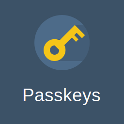

# Passkeys for FreeScout

Passwordless sign-in for [FreeScout](https://freescout.net) using **passkeys** (WebAuthn / FIDO2): Touch ID, Face ID, Windows Hello, Android screen lock, hardware security keys (YubiKey etc.) and password managers.

* Users can **register, rename and remove passkeys** from their profile page.
* The login page gets a **"Login with a passkey"** button, plus passkey autofill (conditional UI) in browsers that support it.

## Requirements

* FreeScout served over **HTTPS** with a valid certificate — the WebAuthn API is only available in secure contexts (plain `http://localhost` works for development). `APP_URL` must match the address users open in the browser, since it is used as the WebAuthn Relying Party ID and expected origin.
* PHP with the **OpenSSL** extension (required by FreeScout itself).
* Any PHP version supported by FreeScout (7.1+).

## Installation

1. Download the [latest release](../../releases) (or clone this repository) and place the folder in the `Modules` directory of your FreeScout installation so that you have `Modules/Passkeys/module.json`.
2. Make sure the files are readable by the web server user.
3. Open **Manage » Modules** in FreeScout and activate **Passkeys**.

The database table is created automatically on activation.

## Usage

**Registering a passkey.** Open your profile (top right menu » Profile) and choose **Passkeys** in the sidebar. Enter an optional name (e.g. "Work laptop") and click **Add passkey**, then follow the browser prompt. Passkeys can be renamed or deleted from the same page at any time.

**Signing in.** On the login page click **Login with a passkey** and pick the passkey in the browser dialog. In browsers with passkey autofill support, focusing the email field also offers your passkeys directly.

Passkeys are an *additional* login method: the regular email/password login keeps working unchanged, and deactivating the module simply removes the passkey login option.

## Security model

* Registration and management require an authenticated session and are protected by FreeScout's CSRF middleware. Users can only ever see and manage **their own** passkeys.
* Passkeys are registered as **discoverable credentials** with *user verification* required by the authenticator by default, so a stolen device alone is not enough — the authenticator's PIN/biometric gate applies, which makes a passkey login effectively multi-factor.
* Server-side verification is performed by the bundled [lbuchs/WebAuthn](https://github.com/lbuchs/WebAuthn) library (challenge, origin, Relying Party ID hash, signature). Because that library's origin check is a loose suffix match, the module adds its **own strict origin-equality check** against `APP_URL` before trusting any ceremony.
* Challenges are **single-use, session-bound, context-separated** (registration challenges cannot satisfy a login and vice-versa) and expire after a short window. Several may be pending at once so passkey autofill and the explicit button can be used together without interfering.
* Each WebAuthn field is size-capped before parsing, and the bundled CBOR decoder is patched with a nesting-depth limit, to keep malformed input from exhausting memory.
* Failed login attempts are rate-limited **per credential** (not per raw IP), so an attacker cannot lock out everyone sharing a NAT/proxy address, and the HTTP endpoints are additionally throttled.
* Where an authenticator reports a signature counter, the module records it and rejects a regression (basic **clone detection**). Note that many platform passkeys — iCloud Keychain, Google Password Manager, Windows Hello — always report a counter of `0`; for those, per the spec, no counter-based detection is possible.
* Attestation is requested as `none` (industry practice for passkeys): no hardware attestation data is collected from users' devices.
* Only **active** FreeScout users can sign in with a passkey; disabled, deleted and not-yet-activated (no password set) accounts are rejected. The session ID is regenerated on login to prevent session fixation, and a user's passkeys are deleted with their account.
* Passkey add / rename / delete and passkey logins are written to FreeScout's **user activity log** for audit purposes.
* The module stores only public keys — no shared secrets. Database contents do not allow anyone to sign in.

### Two-factor authentication

FreeScout's Two-Factor Authentication module enforces its second factor on the normal email/password login only. A passkey login goes through a different code path, so **by default a passkey login does not trigger that module's second-factor prompt** — which is reasonable, because a passkey that requires user verification (PIN or biometric) is already multi-factor.

You can choose the behavior in **Manage » Settings » Passkeys**:

* **"Passkey login satisfies two-factor authentication" ON** *(default)* — a user who signs in with a passkey is taken straight in, even if they also have 2FA configured.
* **OFF** — if a user has 2FA configured, after their passkey is verified the module asks for their two-factor code (validated through the 2FA module's own API) before completing the login. This step **fails closed**: if the code cannot be validated, the login is not completed.

If the Two-Factor Authentication module is not installed, this setting has no effect.

### Other notes

* `APP_URL` **must** match the address users actually open in the browser (scheme, host and port). It is the WebAuthn Relying Party ID and the expected origin; a mismatch makes every passkey operation fail with an "invalid origin" error.

## Credits

* Lead Developer: Ioannis Dressos <idressos@outlook.com>
* Bundled WebAuthn server library: [lbuchs/WebAuthn](https://github.com/lbuchs/WebAuthn) v2.2.0 by Lukas Buchs, MIT license (see `Vendor/WebAuthn/LICENSE`). It is bundled unmodified except for a single hardening change — a CBOR nesting-depth limit — documented in `Vendor/WebAuthn/MODIFICATIONS.md`.

## License

This module is free software released under the **GNU Affero General Public License v3.0 or later** (AGPL-3.0-or-later), the same license family as FreeScout itself — see [LICENSE](LICENSE).

This program is distributed in the hope that it will be useful, but **WITHOUT ANY WARRANTY**; without even the implied warranty of MERCHANTABILITY or FITNESS FOR A PARTICULAR PURPOSE. The authors accept **no liability** for any damages arising from the use of this software — see sections 15 and 16 of the license. You are responsible for operating your FreeScout instance securely (HTTPS, up-to-date software, backups).
